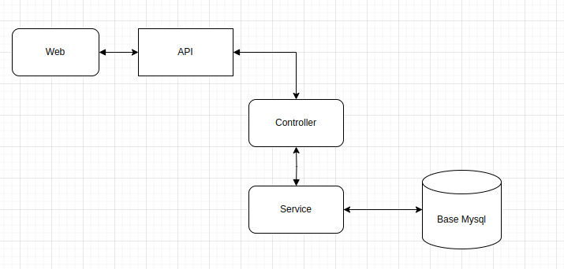
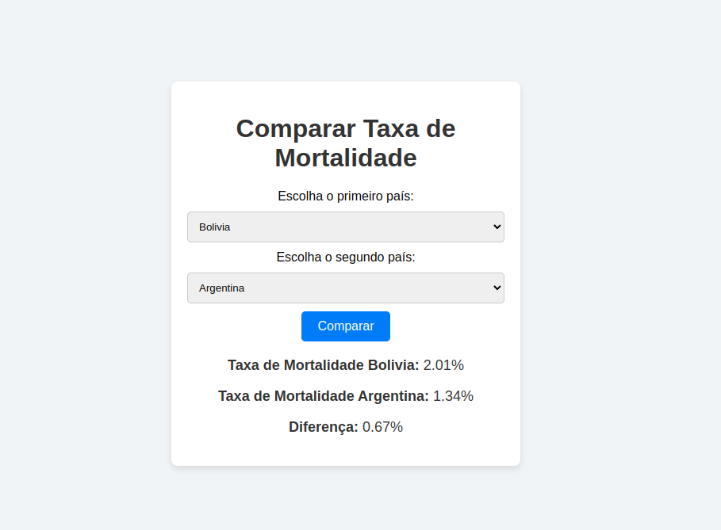
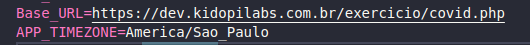

# kodopi-dados-covid
Este projeto apresenta uma análise detalhada dos dados relacionados ao vírus COVID-19, com foco específico nos países Brasil, Canadá e Austrália. Ele inclui informações sobre taxas de mortalidade, número de casos confirmados e óbitos registrados, oferecendo uma visão clara sobre o impacto da pandemia nesses três países. 

## ⚙️ Um pouco sobre a organização do projeto

O projeto esta divido em camadas. 

Controllers, Validações, Services, Models, e por ultimo a base de dados Mysql.



### Area de relatorio


### Area de comparação entre Paises. 



## 🚀 Começando

Essas instruções permitirão que você obtenha uma cópia do projeto.

### 📋 Pré-requisitos

O que vai precisar para instalá-lo?

Docker e o node.

```
https://www.docker.com/
```

### 🔧 Instalação

Uma série de exemplos passo-a-passo que informam o que você deve executar para ter um ambiente de desenvolvimento para a execução do projeto.

Baixar o Docker.

```
Link para dowload: https://www.docker.com/
```
Clonar o repositorio do github

```
https://github.com/guilherf13/kidopi-dados-covid.git
```
Entre dentro da pasta backend

```
cd backend
```
Execute o comando para subir os containers do docker.

```
docker compose up -d --build
```
Crie o arquivo.env

```
cp .env.example .env
```
Subistitua essa configuração pela que esta no seu .env



```
Base_URL=https://dev.kidopilabs.com.br/exercicio/covid.php
APP_TIMEZONE=America/Sao_Paulo
```

```
DB_CONNECTION=mysql
DB_HOST=mysql
DB_PORT=3306
DB_DATABASE=laravel          
DB_USERNAME=username       
DB_PASSWORD=userpass
```

Acesse o container backend

```
docker compose exec backend bash
```

Instale as dependencia do projeto
```
composer install
```

Gere a key do projeto Laravel
```
php artisan key:generate
```

Rodar as migrations

```
php artisan migrate
```
Agora entre na pasta frontend e instale as depedencias do node.

```
cd frontend
npm install
```
O frontend esta ultilizando o servidor http-server do node.
Para executalo basta rodar o comando:

```
http-server -p 8080 --cors="http://127.0.0.1:8080"
```
Para acessar as paginas, são duas rotas:

Pagina de relatorio

```
http://127.0.0.1:8080
```
Pagina de comparação de taxas

```
http://127.0.0.1:8080/pagetaxas/compararPaises
```

### OBS: A documentação das APIs estão no arquivo Documentation.md, dentro da raiz do projeto.

## 🛠️ Construído com

* [Docker](https://www.docker.com/) - Gerenciador de serviços via containers
* [Mysql](https://www.mysql.com/) - Banco de dados para autenticação das apis
* [GIT](https://git-scm.com/downloads) - Controle de versão
* [Node](https://nodejs.org/en) - Usado para criar um mine servidor para localhost com as paginas web 
* [Laravel](https://rometools.github.io/rome/) - Framework para Backend/APIs

